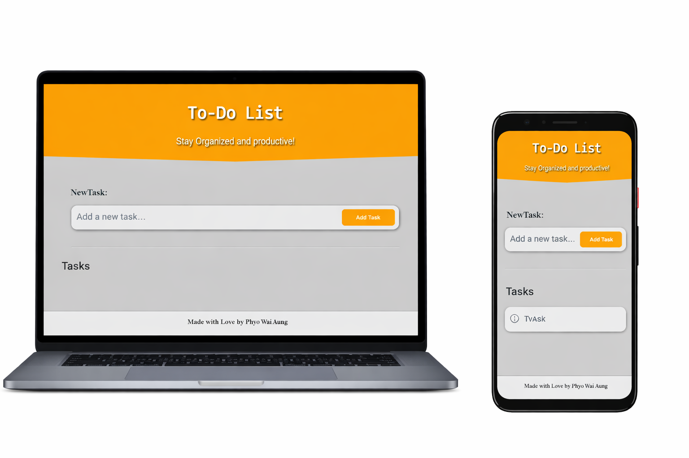
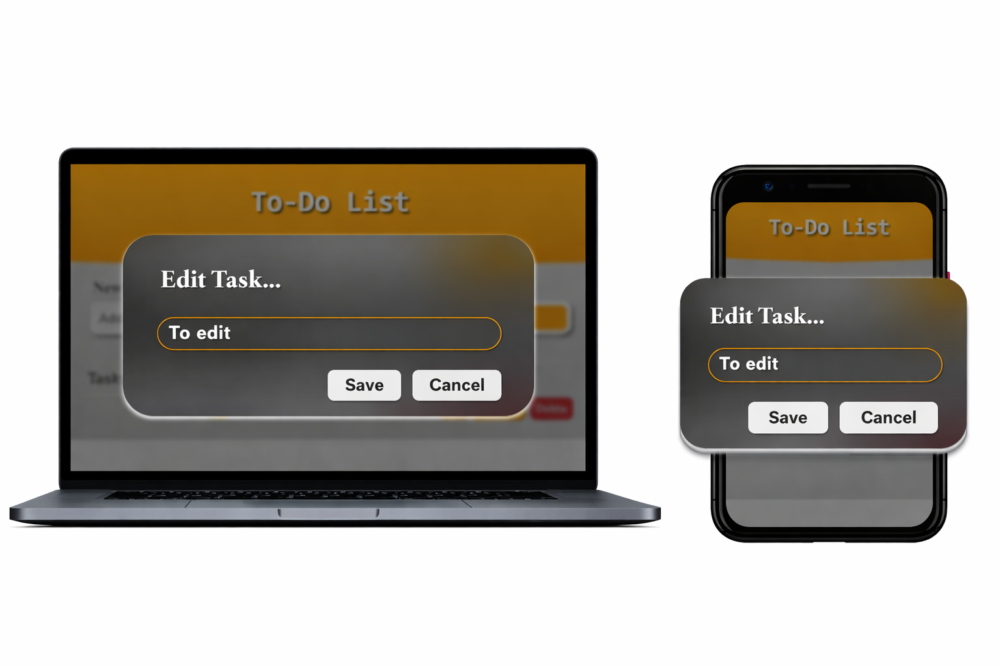

# 📝 To-Do List App

A simple and interactive To-Do List web application built with **HTML, CSS, and JavaScript**.  
It allows users to add, edit, delete, and mark tasks as completed, with data saved in **localStorage** for persistence.

---

## 🚀 Demo
[Live Demo](https://leo15th.github.io/To-Do-List/)  

---

## 📂 Features
- ➕ Add new tasks
- ✏️ Edit existing tasks (popup box)
- ✅ Mark tasks as completed (checkbox + line-through style)
- ❌ Delete tasks
- 💾 Save tasks in localStorage (tasks remain after reload)
- 🔄 Render tasks dynamically with JavaScript

---

## 🛠️ Technologies Used
- **HTML5** – structure
- **CSS3** – styling
- **JavaScript (ES6)** – functionality
- **localStorage** – persistent data storage

---

## 📦 Installation
1. Clone the repository:
   ```bash
   git clone https://github.com/Leo15th/To-Do-List.git

## 📸 Screenshots



## 👤 Author
**Phyo Wai Aung (Leo15th)**  
Aspiring Frontend Developer | React, TailwindCSS, JavaScript
[GitHub Profile](https://github.com/Leo15th)
